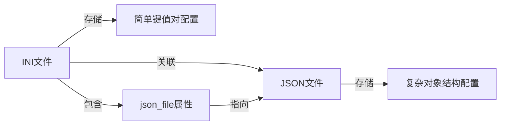
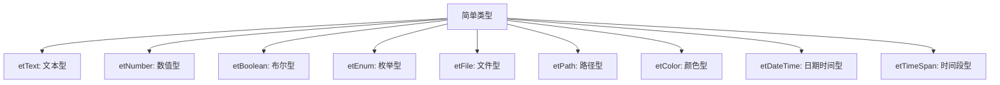
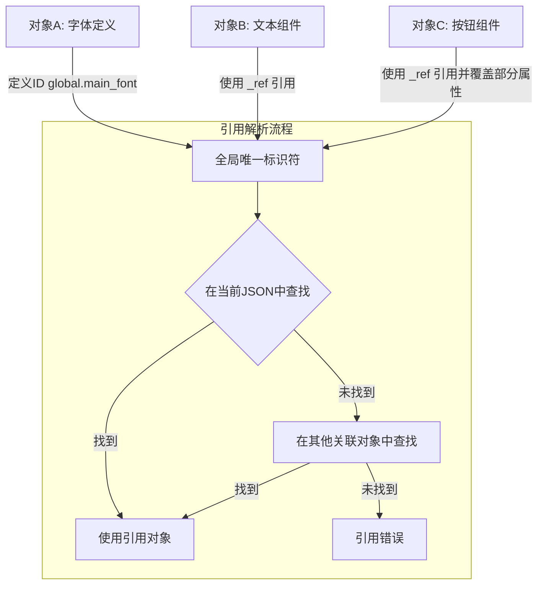
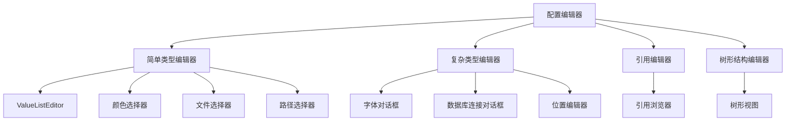
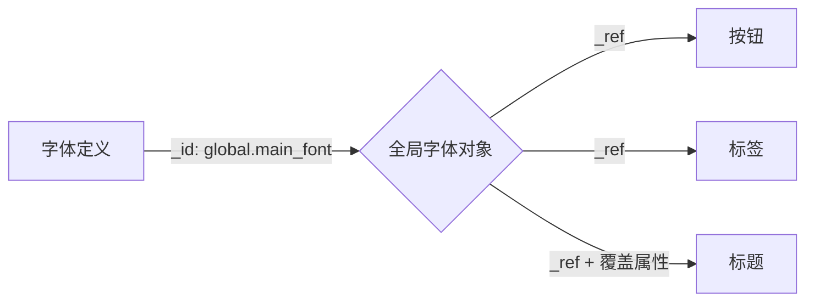
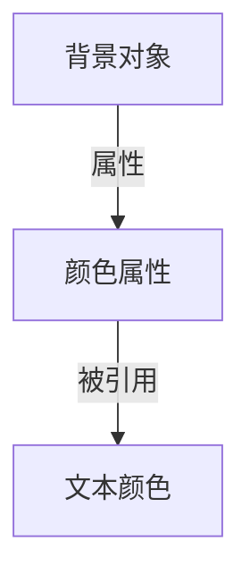
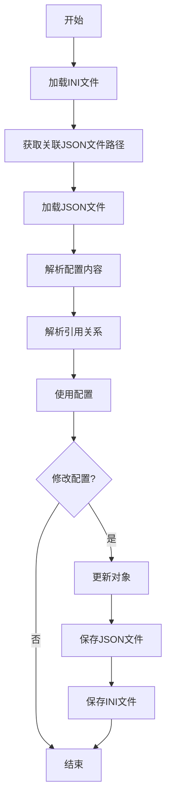
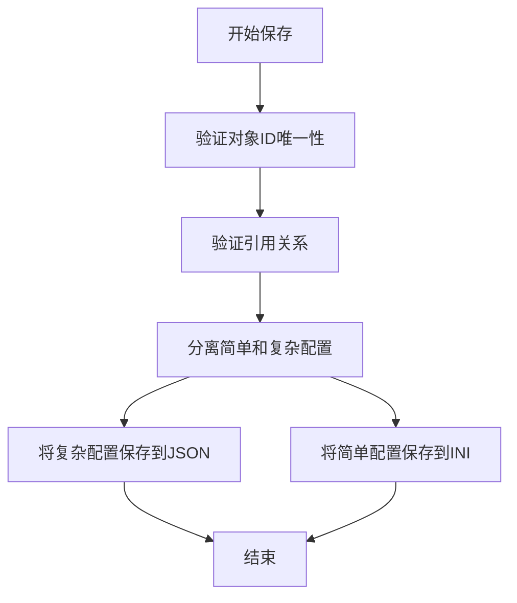
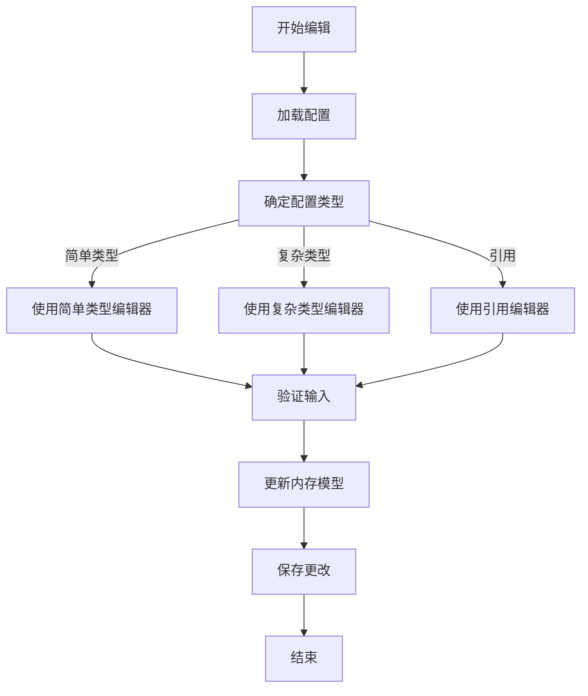

# INI+JSON配置文件规范

**目录**
- [1. 基本约定](#1-基本约定)
- [2. 类型规范](#2-类型规范)
- [3. 对象引用机制](#3-对象引用机制)
- [4. 结构规范](#4-结构规范)
- [5. 元数据规范](#5-元数据规范)
- [6. 最佳实践](#6-最佳实践)
- [7. 编辑器交互约定](#7-编辑器交互约定)
- [8. 示例完整配置](#8-示例完整配置)
- [9. 配置变更与迁移](#9-配置变更与迁移)
- [10. 配置类型与编辑器关系](#10-配置类型与编辑器关系)
- [11. 引用场景与示例](#11-引用场景与示例)
- [12. 配置文件处理流程](#12-配置文件处理流程)
- [13. 结语](#13-结语)
- [14. 编辑器实现指南](#14-编辑器实现指南)
- [15. 位置属性标准化](#15-位置属性标准化)

## 1. 基本约定

### 1.1 文件结构



- 一个完整的配置单元**必须**由一个INI文件和一个JSON文件组成
- INI文件存储简单键值对配置
- JSON文件存储复杂对象结构配置
- 每个INI文件**只关联**一个JSON文件，以降低开发复杂度

### 1.2 INI文件结构
- INI文件必须包含一个特殊节`[json_file]`
- 在该节中必须有一个键`file_path`指定关联的JSON文件路径（相对或绝对）
- 例如：
  ```ini
  [json_file]
  file_path = app_config.json  ; 关联的JSON文件
  ```
- 其余节用于组织简单配置项
- 节名称不允许使用空格，建议使用下划线连接多个单词
- 键名格式：`类型.键名`，其中键名部分可以使用下划线连接多个单词

### 1.3 JSON文件结构
- JSON文件必须是一个有效的JSON对象（以`{}`开始和结束）
- 顶层对象中的键用于对配置进行分类
- 复杂配置项应该嵌套在对应分类下
- 键名不允许使用空格，建议使用下划线连接多个单词

## 2. 类型规范

### 2.1 简单类型（INI文件存储）



#### 2.1.1 文本型 (etText)
```ini
[section_name]
etText.user_name = 张三
etText.description = 这是一段文本
```

#### 2.1.2 数值型 (etNumber)
```ini
[section_name]
etNumber.age = 100
etNumber.price = 3.14
```

#### 2.1.3 布尔型 (etBoolean)
```ini
[section_name]
etBoolean.is_active = true  ; 可接受的值：true/false, yes/no, 1/0
```

#### 2.1.4 枚举型 (etEnum)
```ini
[section_name]
etEnum.user_role = option1,option2,option3 
```

#### 2.1.5 文件型 (etFile)
```ini
[section_name]
etFile.music_file = C:/music/song.mp3
etFile.subtitle_txt = D:/subtitles/movie.txt
```

#### 2.1.6 路径型 (etPath)
```ini
[section_name]
etPath.temp_dir = z:/temp
etPath.audio_folder = D:/music/
```

#### 2.1.7 颜色 (etColor)
```ini
[section_name]
etColor.subtitle_curr = crGreen ; 支持多种颜色定义
etColor.subtitle_pre = crRed
```

#### 2.1.8 日期时间型 (etDateTime)
```ini
[section_name]
etDateTime.created_at = 2023-06-15T14:30:00Z
etDateTime.modified_at = 2023-06-16
```

#### 2.1.9 时间段型 (etTimeSpan)
```ini
[section_name]
etTimeSpan.timeout_period = 00:05:00  ; 5分钟
etTimeSpan.session_duration = 01:30:00  ; 1小时30分钟
```

### 2.2 复杂类型（JSON文件存储）

```mermaid
graph TD
    ComplexTypes[复杂类型] --> Font[etFont: 字体]
    ComplexTypes --> Database[etDatabase: 数据库连接]
    ComplexTypes --> ColorObj[etColor: 颜色对象]
    ComplexTypes --> FileObj[etFile: 文件对象]
    ComplexTypes --> PathObj[etPath: 路径对象]
    ComplexTypes --> BG[etBackGround: 背景]
    ComplexTypes --> Image[etImage: 图像]
    ComplexTypes --> TextOnBG[etTextOnBG: 背景上的文本]
    ComplexTypes --> ImageOnBG[etImageOnBG: 背景上的图像]
    ComplexTypes --> DrawerOnBG[etDrawerOnBG: 背景上的绘图器]
    ComplexTypes --> Subtitle[etSubtitle: 字幕]
    ComplexTypes --> Page[etPage: 页面]
    ComplexTypes --> VideoClip[etVideoClip: 视频片段]
    ComplexTypes --> Conn[etConnection: 网络连接]
    ComplexTypes --> Cred[etCredential: 凭证]
    ComplexTypes --> Local[etLocalization: 本地化]
    ComplexTypes --> Array[etArray: 数组]
    ComplexTypes --> Custom[etCustom: 自定义类型]
    ComplexTypes --> AIAPI[etAIAPI: AI大模型配置]
```



#### 2.2.1 字体 (etFont)
```json
{
  "fonts": {
    "main_font": {
      "_type": "etFont",
      "_id": "etFont.main_font",  // 全局唯一标识符，用于引用
      "name": "微软雅黑",
      "size": 12,
      "color": "#000000",
      "bold": true,
      "italic": false,
      "underline": false,
      "strike_out": false
    }
  }
}
```

#### 2.2.2 数据库连接 (etDatabase)
```json
{
  "database": {
    "main_connection": {
      "_type": "etDatabase",
      "_id": "etDatabase.main_connection",
      "driver": "mysql",
      "host": "localhost",
      "port": 3306,
      "database": "mydb",
      "username": "user",
      "password": "encrypted_password",
      "parameters": {
        "charset": "utf8mb4",
        "timeout": 30
      }
    }
  }
}
```

#### 2.2.3 颜色 (etColor)
```json
{
  "colors": {
    "primary_color": {
      "_type": "etColor",
      "_id": "etColor.primary_color",
      "value": "#FF5733",
      "alpha": 255
    }
  }
}
```

#### 2.2.4 文件路径 (etFile)
```json
{
  "files": {
    "config_file": {
      "_type": "etFile",
      "_id": "etFile.config_file",
      "path": "D:\\config\\settings.xml",
      "required": true
    }
  }
}
```

#### 2.2.5 目录路径 (etPath)
```json
{
  "paths": {
    "data_directory": {
      "_type": "etPath",
      "_id": "etPath.data_directory",
      "path": "D:\\app\\data",
      "create_if_missing": true
    }
  }
}
```

#### 2.2.6 背景设置 (etBackGround)
```json
{
  "ui": {
    "main_background": {
      "_type": "etBackGround",
      "_id": "etBackGround.main_background",
      "color": "#F5F5F5",
      "image": {
        "path": "assets/bg.jpg",
        "opacity": 0.7,
        "stretch": "uniform"
      },
      "gradient": {
        "start_color": "#F5F5F5",
        "end_color": "#E0E0E0",
        "direction": "vertical"
      }
    }
  }
}
```

#### 2.2.7 图像 (etImage)
```json
{
  "images": {
    "logo": {
      "_type": "etImage",
      "_id": "etImage.app_logo",
      "path": "assets/logo.png",
      "width": 200,
      "height": 100,
      "format": "png",
      "position": {
        "x": 0,
        "y": 0,
        "isXcenter": false,
        "isYcenter": false,
        "scale": 0.6
      }
    }
  }
}
```

#### 2.2.8 背景上的文本 (etTextOnBG)
```json
{
  "ui_elements": {
    "header_text": {
      "_type": "etTextOnBG",
      "_id": "etTextOnBG.header_text",
      "text": "欢迎使用",
      "font": {
        "_ref": "etFont.main_font"
      },
      "position": {
        "x": 100,
        "y": 50,
        "isXcenter": true,
        "isYcenter": false,
        "scale": 1.0
      },
      "background": {
        "_ref": "etBackGround.main_background"
      }
    }
  }
}
```

#### 2.2.9 背景上的图像 (etImageOnBG)
```json
{
  "ui_elements": {
    "logo_on_header": {
      "_type": "etImageOnBG",
      "_id": "etImageOnBG.logo_on_header",
      "image": {
        "_ref": "etImage.app_logo"
      },
      "position": {
        "x": 20,
        "y": 20,
        "isXcenter": false,
        "isYcenter": false,
        "scale": 0.8
      },
      "background": {
        "_ref": "etBackGround.header_bg"
      }
    }
  }
}
```

#### 2.2.10 背景上的绘图器 (etDrawerOnBG)
```json
{
  "drawers": {
    "chart_on_panel": {
      "_type": "etDrawerOnBG",
      "_id": "etDrawerOnBG.chart_on_panel",
      "type": "line_chart",
      "properties": {
        "line_width": 2,
        "line_color": "#0000FF",
        "show_markers": true
      },
      "position": {
        "x": 50,
        "y": 100,
        "isXcenter": false,
        "isYcenter": false,
        "scale": 1.0
      },
      "background": {
        "_ref": "etBackGround.chart_bg"
      }
    }
  }
}
```

#### 2.2.11 字幕 (etSubtitle)
```json
{
  "subtitles": {
    "default_subtitle": {
      "_type": "etSubtitle",
      "_id": "etSubtitle.default_subtitle",
      "font": {
        "_ref": "etFont.subtitle_font"
      },
      "position": {
        "x": 0,
        "y": 0,
        "isXcenter": true,
        "isYcenter": false,
        "scale": 1.0
      }
    }
  }
}
```

#### 2.2.12 大模型API配置 (etAIAPI)
```json
{
  "ai_providers": {
    "openai_gpt4": {
      "_type": "etAIAPI",
      "_id": "etAIAPI.openai_gpt4",
      "provider": "OpenAI",
      "model": "gpt-4",
      "api_endpoint": "https://api.openai.com/v1/chat/completions",
      "api_key": {
        "_ref": "etCredential.openai_key"  // 引用加密存储的API密钥
      },
      "parameters": {
        "temperature": 0.7,
        "max_tokens": 4000,
        "top_p": 1.0,
        "frequency_penalty": 0,
        "presence_penalty": 0
      },
      "timeout": 30,
      "retry": {
        "max_retries": 3,
        "retry_interval": 2,
        "backoff_factor": 1.5
      },
      "output_format": "json",
      "proxy": {
        "enabled": false,
        "url": ""
      }
    },
    "anthropic_claude": {
      "_type": "etAIAPI",
      "_id": "etAIAPI.anthropic_claude",
      "provider": "Anthropic",
      "model": "claude-3-opus-20240229",
      "api_endpoint": "https://api.anthropic.com/v1/messages",
      "api_key": {
        "_ref": "etCredential.anthropic_key"
      },
      "parameters": {
        "temperature": 0.5,
        "max_tokens": 8000,
        "top_p": 0.9
      },
      "timeout": 60,
      "system_prompt": "你是一个AI助手，请提供准确和有帮助的回答。"
    }
  }
}
```

## 3. 对象引用机制



### 3.1 全局唯一标识符 (_id)
- 复杂对象可以通过`_id`属性定义全局唯一标识符
- 该标识符应符合命名空间格式：`域.名称`，如`global.main_font`
- 标识符在所有配置文件中必须唯一
- 标识符应该简洁明了，反映对象用途

### 3.2 引用方式 (_ref)
可以通过以下方式引用已定义的对象：

#### 3.2.1 完全引用
使用`_ref`属性直接引用一个对象的完整ID：
```json
{
  "font": {
    "_ref": "global.main_font"  // 完全引用global.main_font对象
  }
}
```

#### 3.2.2 部分属性引用并覆盖
引用一个对象并覆盖特定属性：
```json
{
  "font": {
    "_ref": "global.main_font",  // 引用基础对象
    "size": 14,                  // 覆盖size属性
    "bold": false                // 覆盖bold属性
  }
}
```

#### 3.2.3 嵌套对象的引用
引用嵌套对象的特定属性：
```json
{
  "background_color": {
    "_ref": "ui.main_bg.color"  // 引用ui.main_bg对象的color属性
  }
}
```

### 3.3 引用解析规则
1. 先在当前JSON文件中查找引用的对象
2. 如果在当前文件中找不到，则报错（引用不存在）
3. 如果找到多个匹配项，则报错（ID冲突）

### 3.4 循环引用检测
- 系统必须检测并禁止循环引用
- 例如：A引用B，B引用C，C引用A的情况
- 发现循环引用时应抛出明确的错误

## 4. 结构规范

### 4.1 复合结构
复合结构是由多个配置项组成的树形结构：

```json
{
  "application": {
    "ui": {
      "main_window": {
        "_type": "etCustom",
        "_id": "app.main_window",
        "width": 800,
        "height": 600,
        "title": "我的应用",
        "theme": {
          "_type": "etCustom",
          "_id": "app.theme",
          "name": "dark",
          "colors": {
            "background": "#333333",
            "foreground": "#FFFFFF"
          }
        }
      }
    }
  }
}
```

### 4.2 数组结构
对于同类型的多个项目，使用数组结构：

```json
{
  "recent_files": {
    "_type": "etArray",
    "_id": "app.recent_files",
    "items": [
      {
        "path": "D:\\doc1.txt",
        "last_opened": "2023-05-20T14:30:00Z"
      },
      {
        "path": "D:\\doc2.txt",
        "last_opened": "2023-05-19T10:15:00Z"
      }
    ],
    "max_count": 10
  }
}
```

## 5. 元数据规范

### 5.1 类型标识
- 每个复杂对象应包含`_type`字段，用于标识其类型，值必须是TConfigType枚举中的一个:
  - etText: 文本类型
  - etNumber: 数值类型
  - etBoolean: 布尔类型
  - etFont: 字体类型
  - etDatabase: 数据库连接
  - etColor: 颜色类型
  - etEnum: 枚举类型
  - etFile: 文件路径
  - etPath: 目录路径
  - etBackGround: 背景设置
  - etImage: 图像配置
  - etTextOnBG: 背景上的文本
  - etImageOnBG: 背景上的图像
  - etDrawerOnBG: 背景上的绘图器
  - etSubtitle: 字幕配置
  - etPage: 页面布局
  - etVideoClip: 视频片段
  - etDateTime: 日期时间类型
  - etTimeSpan: 时间段类型
  - etConnection: 网络连接配置
  - etCredential: 凭证配置
  - etLocalization: 本地化配置
  - etArray: 数组类型
  - etAIAPI: AI大模型配置
  - etCustom: 自定义类型
- 对于自定义类型，可以添加`custom_type`进一步细化

### 5.2 注释与描述
INI文件可以使用分号（;）添加注释：
```ini
; 这是一个注释
[section]
text.key = value  ; 行尾注释
```

JSON不支持原生注释，但可以使用特殊字段：
```json
{
  "setting": {
    "_description": "这是对此设置的描述",
    "_category": "appearance",  // 用于分类
    "_required": true,          // 标记必填项
    "value": 42
  }
}
```

### 5.3 验证规则
可以添加验证规则来约束值的范围：

```json
{
  "settings": {
    "volume": {
      "_type": "etNumber",
      "value": 80,
      "min": 0,
      "max": 100,
      "step": 5
    }
  }
}
```

## 6. 最佳实践

### 6.1 命名约定
- 使用小写字母和下划线命名键
- 类别使用复数形式（如`fonts`, `colors`, `settings`）
- 具体项目使用单数形式或具体名称
- 对象ID使用域名前缀，如`global.`, `ui.`, `db.`等
- 简单类型的键名格式为`类型.键名`（例如：`text.user_name`, `number.price`）
- 键名部分使用下划线连接多个单词（例如：`user_name`, `max_price`）

### 6.2 组织原则
- 相关的配置项应该放在同一节或对象中
- 按功能域组织配置（UI、数据、网络等）
- 常用配置项放在顶层或容易访问的位置
- 可重用的组件（如字体、颜色）应定义ID并通过引用使用

### 6.3 安全考虑
- 敏感信息（如密码）应该加密存储
- 可以使用占位符代替硬编码的敏感信息
- 考虑使用环境变量或外部凭证存储

### 6.4 扩展性
- 预留配置空间供未来扩展
- 使用版本字段跟踪配置格式变化
- 考虑向后兼容性

## 7. 编辑器交互约定



### 7.1 简单类型编辑
- 使用`ValueListEditor`或类似组件进行基本类型(文本、数字、布尔值)编辑
- 提供适当的输入验证
- 对于枚举类型，提供下拉选择

### 7.1.1 颜色编辑器
- 虽然颜色(etColor)是简单类型，但需要专门的颜色选择器编辑器
- 提供颜色预览和RGB/HSL值编辑
- 支持常用颜色快速选择

### 7.1.2 文件选择器
- 为文件类型(etFile)提供文件浏览对话框
- 支持文件类型过滤和预览
- 提供最近选择的文件列表

### 7.1.3 路径选择器
- 为路径类型(etPath)提供目录浏览对话框
- 支持创建新目录
- 提供常用路径快速选择

### 7.2 复杂类型编辑
- 提供专用的模态对话框进行编辑
- 支持实时预览（如字体、颜色）
- 提供模板选择功能
- 对于引用对象，提供浏览和选择功能

### 7.2.1 位置编辑器
- 为所有带有位置属性的类型(etTextOnBG, etImageOnBG, etDrawerOnBG, etSubtitle)提供位置编辑器
- 支持可视化拖拽定位
- X/Y坐标数值微调
- 居中选项和缩放比例调整

### 7.3 引用编辑器
- 提供在编辑器中浏览和选择可用对象ID的功能
- 显示引用对象的预览
- 允许创建新引用或选择现有引用
- 提供引用冲突检测和解决工具

### 7.4 树形结构编辑
- 使用树形控件展示结构
- 提供添加、删除、移动节点的功能
- 支持导入/导出子树

### 7.5 批量操作
- 支持多项选择和批量修改
- 提供搜索和替换功能
- 支持配置的复制和粘贴

## 8. 示例完整配置

### 8.1 INI文件示例 (app_config.ini)
```ini
[json_file]
file_path = app_config.json    ; 关联的JSON文件

[app_settings]
text.app_name = 我的应用程序
text.version = 1.0.0
text.language = zh-CN
boolean.debug_mode = false

[user_preferences]
text.theme = dark
boolean.auto_save = true
number.save_interval = 300 ; 秒
```

### 8.2 JSON文件示例 (fonts.json)
```json
{
  "fonts": {
    "main_font": {
      "_type": "etFont",
      "_id": "etFont.main_font",
      "_description": "应用程序的主要字体",
      "name": "微软雅黑",
      "size": 12,
      "color": "#000000",
      "bold": false,
      "italic": false
    },
    "title_font": {
      "_type": "etFont",
      "_id": "etFont.title_font",
      "_description": "标题字体",
      "name": "微软雅黑",
      "size": 16,
      "color": "#333333",
      "bold": true,
      "italic": false
    }
  }
}
```

### 8.3 JSON文件示例 (themes.json)
```json
{
  "themes": {
    "dark": {
      "_type": "etCustom",
      "_id": "themes.dark",
      "name": "Dark Theme",
      "colors": {
        "background": "#333333",
        "foreground": "#FFFFFF",
        "accent": "#1E90FF"
      }
    },
    "light": {
      "_type": "etCustom",
      "_id": "themes.light",
      "name": "Light Theme",
      "colors": {
        "background": "#F5F5F5",
        "foreground": "#333333",
        "accent": "#0078D7"
      }
    }
  }
}
```

### 8.4 JSON文件示例 (ui_config.json)
```json
{
  "ui": {
    "main_window": {
      "_type": "etCustom",
      "_id": "ui.main_window",
      "width": 1024,
      "height": 768,
      "state": "maximized",
      "font": {
        "_ref": "etFont.main_font"  // 引用fonts.json中定义的字体
      }
    },
    "dialogs": {
      "settings_dialog": {
        "_type": "etPage",
        "_id": "ui.settings_dialog",
        "title": "设置",
        "width": 600,
        "height": 400,
        "sections": [
          {
            "name": "general",
            "title": "常规设置",
            "font": {
              "_ref": "etFont.title_font"  // 引用fonts.json中定义的字体
            }
          },
          {
            "name": "appearance",
            "title": "外观设置",
            "theme": {
              "_ref": "themes.dark"  // 引用themes.json中定义的主题
            }
          }
        ]
      }
    }
  }
}
```

### 8.5 JSON文件示例 (app_config.json)
```json
{
  "fonts": {
    "main_font": {
      "_type": "etFont",
      "_id": "etFont.main_font",
      "_description": "应用程序的主要字体",
        "name": "微软雅黑",
      "size": 12,
      "color": "#000000",
      "bold": false,
      "italic": false
    },
    "title_font": {
      "_type": "etFont",
      "_id": "etFont.title_font",
      "_description": "标题字体",
      "name": "微软雅黑",
      "size": 16,
      "color": "#333333",
      "bold": true,
      "italic": false
    }
  },
  "themes": {
    "dark": {
      "_type": "etCustom",
      "_id": "themes.dark",
      "name": "Dark Theme",
    "colors": {
        "background": "#333333",
        "foreground": "#FFFFFF",
        "accent": "#1E90FF"
      }
    },
    "light": {
      "_type": "etCustom",
      "_id": "themes.light",
      "name": "Light Theme",
      "colors": {
        "background": "#F5F5F5",
        "foreground": "#333333",
        "accent": "#0078D7"
      }
    }
  },
  "ui": {
    "main_window": {
      "_type": "etCustom",
      "_id": "ui.main_window",
      "width": 1024,
      "height": 768,
      "state": "maximized",
      "font": {
        "_ref": "etFont.main_font"
      }
    },
    "dialogs": {
      "settings_dialog": {
        "_type": "etPage",
        "_id": "ui.settings_dialog",
        "title": "设置",
        "width": 600,
        "height": 400,
        "sections": [
          {
            "name": "general",
            "title": "常规设置",
            "font": {
              "_ref": "etFont.title_font"
            }
          },
          {
            "name": "appearance",
            "title": "外观设置",
            "theme": {
              "_ref": "themes.dark"
            }
          }
        ]
      }
    }
  },
  "database": {
    "main_connection": {
      "_type": "etDatabase",
      "_id": "etDatabase.main_connection",
      "driver": "mysql",
      "host": "localhost",
      "port": 3306,
      "database": "app_db",
      "username": "app_user",
      "password": "encrypted:AQIDBAUGBwgJCgsMDQ4PEA=="
    }
  },
  "paths": {
    "data_dir": {
      "_type": "etPath",
      "_id": "etPath.data_dir",
      "path": "D:\\AppData\\",
      "create_if_missing": true
    },
    "temp_dir": {
      "_type": "etPath",
      "_id": "etPath.temp_dir",
      "path": "%TEMP%\\MyApp\\",
      "create_if_missing": true
    }
  },
  "recent_files": {
    "_type": "etArray",
    "_id": "app.recent_files",
    "items": [
      "D:\\Documents\\doc1.txt",
      "D:\\Documents\\doc2.txt",
      "D:\\Documents\\doc3.txt"
    ],
    "max_count": 10
  }
}
```

## 9. 配置变更与迁移

### 9.1 版本控制
在INI文件中添加版本信息：
```ini
[version]
text.config_format_version = 2.0
date.last_updated = 2023-06-01T12:00:00Z
```

### 9.2 配置迁移
当配置格式发生变化时，应提供迁移路径：
```json
{
  "_migration": {
    "from_version": "1.0",
    "to_version": "2.0",
    "renamed_keys": {
      "old.key_name": "new.key_name"
    },
    "removed_keys": [
      "deprecated.key"
    ]
  }
}
```

## 10. 配置类型与编辑器关系

### 10.1 简单类型与编辑器对应关系
| 配置类型      | 编辑方式     | 编辑器控件             |
|-------------|-------------|----------------------|
| etText      | 文本输入     | TEdit, TMemo         |
| etNumber    | 数值输入     | TSpinEdit, TNumberBox|
| etBoolean   | 勾选框      | TCheckBox            |
| etEnum      | 下拉选择     | TComboBox            |
| etFile      | 文件选择器   | TFileOpenDialog + TEdit + 按钮 |
| etPath      | 路径选择器   | TSelectDirectoryDialog + TEdit + 按钮 |
| etColor     | 颜色选择器   | TColorDialog + TColorBox |
| etDateTime  | 日期时间选择 | TDateTimePicker      |
| etTimeSpan  | 时间段选择   | 自定义时间段选择器     |

### 10.2 复杂类型与专用编辑器
| 配置类型         | 编辑方式            | 编辑器特性                           |
|----------------|-------------------|-----------------------------------|
| etFont         | 字体对话框          | 字体名称、大小、样式、颜色预览           |
| etDatabase     | 数据库连接对话框      | 连接类型选择、参数输入、测试连接         |
| etBackGround   | 背景设置对话框        | 颜色、图像、渐变设置预览               |
| etImage        | 图像设置对话框        | 图像预览、位置调整、缩放设置            |
| etTextOnBG     | 文本位置编辑器        | 可视化文本定位、字体配置、背景引用        |
| etImageOnBG    | 图像位置编辑器        | 可视化图像定位、缩放设置、背景引用        |
| etDrawerOnBG   | 绘图位置编辑器        | 绘图类型、属性设置、位置调整、背景引用     |
| etSubtitle     | 字幕设置对话框        | 字体设置、位置调整、预览               |
| etPage         | 页面布局设计器        | 可视化布局、元素拖放、属性编辑           |
| etVideoClip    | 视频片段编辑器        | 时间范围选择、预览播放、音量调整         |
| etConnection   | 连接配置编辑器        | URL设置、超时配置、头信息编辑           |
| etCredential   | 凭证编辑器          | 敏感信息加密、有效期设置               |
| etLocalization | 本地化编辑器         | 多语言文本编辑、默认值设置              |
| etArray        | 数组编辑器          | 项目添加/删除/排序、类型验证            |
| etAIAPI        | AI大模型配置编辑器    | API提供商选择、参数设置、API密钥管理、测试连接 |
| etCustom       | 自定义编辑器         | 根据具体类型定制界面和功能              |

## 11. 引用场景与示例

### 11.1 多处使用相同字体



**字体定义**:
```json
{
  "fonts": {
    "main_font": {
      "_type": "etFont",
      "_id": "etFont.main_font",
      "name": "微软雅黑",
      "size": 12,
      "color": "#000000"
    }
  }
}
```

**在多处引用**:
```json
{
  "ui_elements": {
    "button": {
      "font": { "_ref": "etFont.main_font" }
    },
    "label": {
      "font": { "_ref": "etFont.main_font" }
    },
    "dialog": {
      "title_font": {
        "_ref": "etFont.main_font",
        "size": 14,  // 覆盖尺寸
        "bold": true  // 添加粗体
      }
    }
  }
}
```

### 11.2 主题中引用颜色

**定义颜色**:
```json
{
  "colors": {
    "primary": {
      "_type": "etColor",
      "_id": "etColor.primary",
      "value": "#0078D7"
    },
    "secondary": {
      "_type": "etColor",
      "_id": "etColor.secondary",
      "value": "#E81123"
    }
  }
}
```

**在主题中引用**:
```json
{
  "themes": {
    "default": {
      "_type": "etCustom",
      "_id": "themes.default",
      "button_background": { "_ref": "etColor.primary" },
      "button_text": "#FFFFFF",
      "alert_background": { "_ref": "etColor.secondary" }
    }
  }
}
```

### 11.3 嵌套属性引用



**定义背景对象**:
```json
{
  "ui": {
    "main_background": {
      "_type": "etBackGround",
      "_id": "etBackGround.main_background",
      "color": "#333333",
      "image": {
        "path": "assets/bg.jpg"
      }
    }
  }
}
```

**引用背景颜色**:
```json
{
  "text": {
    "title": {
      "content": "标题文本",
      "color": {
        "_ref": "etBackGround.main_background.color"  // 引用背景对象的颜色属性
      }
    }
  }
}
```

## 12. 配置文件处理流程



### 12.1 加载流程

1. **加载INI文件**
   - 解析INI文件内容，提取所有节和键值对
   - 从`[json_file]`节中获取关联的JSON文件路径

2. **加载JSON文件**
   - 检查JSON文件是否存在，不存在则创建空JSON
   - 解析JSON内容为对象层次结构

3. **验证与规范化**
   - 验证所有必需的键和值
   - 验证类型标识的有效性
   - 为缺失的可选字段提供默认值

4. **解析引用关系**
   - 查找并解析所有`_ref`引用
   - 检测并阻止循环引用
   - 生成完整的配置对象图

### 12.2 保存流程



1. **对象图转换**
   - 将内存中的对象转换为适合序列化的结构
   - 处理循环引用和复杂类型

2. **分离配置**
   - 将简单类型配置提取到INI部分
   - 将复杂类型配置提取到JSON部分

3. **序列化与写入**
   - 序列化JSON内容，确保格式化和可读性
   - 写入INI文件，保留注释和结构
   - 更新文件的版本和时间戳

### 12.3 编辑流程



1. **编辑器选择**
   - 根据配置项的类型选择适当的编辑器
   - 加载编辑器所需的依赖资源和数据

2. **值验证**
   - 提供实时验证和反馈
   - 确保输入符合类型和范围要求

3. **引用选择**
   - 提供现有对象的浏览和选择
   - 允许覆盖引用对象的特定属性

4. **提交更改**
   - 将编辑后的值应用到内存模型
   - 提供取消和回滚功能
   - 保存更改到配置文件

## 13. 结语

本规范定义了INI+JSON配置文件的组织结构和使用方式，规范了各种配置类型的表示方法并提供了强大的对象引用机制。通过合理划分简单配置和复杂配置，可以既保持配置的可读性，又支持复杂的数据结构表达和重用。

INI文件与单个JSON文件的一对一关联简化了开发复杂度，使配置管理更加清晰和可维护。引用机制使得在多处重用相同的配置成为可能，减少了重复定义，提高了配置的一致性。

通过提供完整的配置处理流程图和详细的使用示例，本规范为开发人员提供了清晰的实施指南。配置类型与编辑器的对应关系确保了用户体验的一致性和可用性。

应用程序应遵循此规范来读取和写入配置，并为不同类型的配置提供对应的编辑界面。对于开发者，本规范提供了清晰的指导，使配置系统具有一致性和可扩展性。对于用户，专用的编辑器将使配置过程更加直观和友好。

## 14. 编辑器实现指南

### 14.1 简单类型编辑器实现

简单类型虽然在INI文件中存储，但对于特定类型（颜色、文件、路径）需要专门的编辑器界面：

#### 14.1.1 颜色编辑器
```pascal
procedure TConfigEditor.EditColor(const ConfigKey: string; var Value: string);
var
  ColorDialog: TColorDialog;
  Color: TColor;
begin
  ColorDialog := TColorDialog.Create(nil);
  try
    // 初始化颜色值
    if Value.StartsWith('cr') then // 颜色常量如crRed
      Color := StringToColor(Value)
    else if Value.StartsWith('#') then // HTML颜色如#FF0000
      Color := HTMLToColor(Value);
    
    ColorDialog.Color := Color;
    
    if ColorDialog.Execute then
    begin
      // 将选择的颜色转换回适当的格式
      Value := ColorToString(ColorDialog.Color);
    end;
  finally
    ColorDialog.Free;
  end;
end;
```

#### 14.1.2 文件选择器
```pascal
procedure TConfigEditor.EditFile(const ConfigKey: string; var Value: string);
var
  OpenDialog: TOpenDialog;
begin
  OpenDialog := TOpenDialog.Create(nil);
  try
    // 根据键名确定文件过滤器
    if ConfigKey.Contains('mp3') or ConfigKey.Contains('audio') then
      OpenDialog.Filter := '音频文件 (*.mp3;*.wav)|*.mp3;*.wav|所有文件 (*.*)|*.*'
    else if ConfigKey.Contains('subtitle') then
      OpenDialog.Filter := '字幕文件 (*.srt;*.ass;*.txt)|*.srt;*.ass;*.txt|所有文件 (*.*)|*.*'
    else
      OpenDialog.Filter := '所有文件 (*.*)|*.*';
    
    // 设置初始目录
    if FileExists(Value) then
      OpenDialog.InitialDir := ExtractFilePath(Value);
    
    if OpenDialog.Execute then
      Value := OpenDialog.FileName;
  finally
    OpenDialog.Free;
  end;
end;
```

#### 14.1.3 路径选择器
```pascal
procedure TConfigEditor.EditPath(const ConfigKey: string; var Value: string);
var
  SelectDirDialog: TSelectDirectoryDialog;
begin
  SelectDirDialog := TSelectDirectoryDialog.Create(nil);
  try
    // 设置初始目录
    if DirectoryExists(Value) then
      SelectDirDialog.InitialDir := Value;
    
    if SelectDirDialog.Execute then
      Value := IncludeTrailingPathDelimiter(SelectDirDialog.FileName);
  finally
    SelectDirDialog.Free;
  end;
end;
```

### 14.2 复杂类型编辑器实现

对于视觉定位类型（如etTextOnBG, etImageOnBG, etDrawerOnBG, etSubtitle），需要提供可视化编辑体验：

#### 14.2.1 位置编辑器基类
```pascal
// 所有需要位置编辑的类型的基础编辑器
TPositionEditorBase = class(TForm)
private
  FConfigItem: TJSONObject;  // 当前编辑的配置项
  FPreviewPanel: TPanel;     // 预览面板
  FXEdit: TSpinEdit;         // X坐标编辑
  FYEdit: TSpinEdit;         // Y坐标编辑
  FScaleEdit: TFloatSpinEdit; // 缩放比例编辑
  FXCenterCheck: TCheckBox;  // X居中复选框
  FYCenterCheck: TCheckBox;  // Y居中复选框
  
  procedure UpdatePreview;   // 更新预览
  procedure OnPositionChanged(Sender: TObject);
  procedure OnDragMove(Sender: TObject; Shift: TShiftState; X, Y: Integer);
protected
  // 子类实现具体的预览渲染
  procedure RenderPreview; virtual; abstract;
public
  constructor Create(AOwner: TComponent; ConfigItem: TJSONObject); reintroduce;
  function Execute: Boolean;
end;
```

#### 14.2.2 背景上的文本编辑器
```pascal
TTextOnBGEditor = class(TPositionEditorBase)
private
  FTextEdit: TMemo;         // 文本编辑
  FFontButton: TButton;     // 字体选择按钮
  FBackgroundButton: TButton; // 背景选择按钮
  
  procedure OnFontClick(Sender: TObject);
  procedure OnBackgroundClick(Sender: TObject);
  procedure OnTextChange(Sender: TObject);
protected
  procedure RenderPreview; override;
public
  constructor Create(AOwner: TComponent; ConfigItem: TJSONObject); reintroduce;
end;
```

#### 14.2.3 背景上的图像编辑器
```pascal
TImageOnBGEditor = class(TPositionEditorBase)
private
  FImagePathEdit: TEdit;    // 图像路径编辑
  FBrowseButton: TButton;   // 浏览按钮
  FBackgroundButton: TButton; // 背景选择按钮
  
  procedure OnBrowseClick(Sender: TObject);
  procedure OnBackgroundClick(Sender: TObject);
protected
  procedure RenderPreview; override;
public
  constructor Create(AOwner: TComponent; ConfigItem: TJSONObject); reintroduce;
end;
```

#### 14.2.4 位置编辑器工厂
```pascal
// 根据配置类型创建相应的编辑器
function CreatePositionEditor(AOwner: TComponent; ConfigItem: TJSONObject): TPositionEditorBase;
begin
  case GetConfigType(ConfigItem) of
    etTextOnBG: Result := TTextOnBGEditor.Create(AOwner, ConfigItem);
    etImageOnBG: Result := TImageOnBGEditor.Create(AOwner, ConfigItem);
    etDrawerOnBG: Result := TDrawerOnBGEditor.Create(AOwner, ConfigItem);
    etSubtitle: Result := TSubtitleEditor.Create(AOwner, ConfigItem);
    else
      raise Exception.Create('不支持的配置类型');
  end;
end;
```

#### 14.2.5 AI大模型配置编辑器
```pascal
TAIAPIEditor = class(TForm)
private
  FConfigItem: TJSONObject;
  FProviderCombo: TComboBox;  // 提供商选择
  FModelEdit: TEdit;          // 模型名称
  FEndpointEdit: TEdit;       // API端点
  FApiKeyButton: TButton;     // API密钥选择按钮
  FTempTrackBar: TTrackBar;   // 温度参数滑块
  FMaxTokensEdit: TSpinEdit;  // 最大令牌数
  FTestButton: TButton;       // 测试连接按钮
  FResponseMemo: TMemo;       // 测试响应结果
  
  procedure OnProviderChange(Sender: TObject);
  procedure OnApiKeySelect(Sender: TObject);
  procedure OnTestConnection(Sender: TObject);
  procedure LoadProviderDefaults(const Provider: string);
  function TestAPIConnection: Boolean;
public
  constructor Create(AOwner: TComponent; ConfigItem: TJSONObject); reintroduce;
  function Execute: Boolean;
end;

// 实现示例
procedure TAIAPIEditor.OnTestConnection(Sender: TObject);
var
  TestPrompt: string;
  Response: string;
begin
  TestPrompt := '简短回答: 你是什么AI模型?';
  FResponseMemo.Lines.Clear;
  FResponseMemo.Lines.Add('正在测试连接，请稍候...');
  
  if TestAPIConnection then
  begin
    // 处理API响应
    FResponseMemo.Lines.Clear;
    FResponseMemo.Lines.Add('连接成功!');
    FResponseMemo.Lines.Add('模型响应: ' + Response);
  end
  else
  begin
    FResponseMemo.Lines.Clear;
    FResponseMemo.Lines.Add('连接失败，请检查API配置。');
  end;
end;
```

#### 14.2.6 API提供商模板
```pascal
// 为不同的AI提供商提供默认参数模板
procedure LoadAIProviderTemplates(Combo: TComboBox);
begin
  Combo.Items.Clear;
  
  // 添加常见的AI提供商
  Combo.Items.Add('OpenAI');
  Combo.Items.Add('Anthropic');
  Combo.Items.Add('Google');
  Combo.Items.Add('Mistral AI');
  Combo.Items.Add('Azure OpenAI');
  Combo.Items.Add('自定义');
end;

// 获取提供商默认设置
function GetProviderDefaults(const Provider: string): TJSONObject;
var
  Defaults: TJSONObject;
begin
  Defaults := TJSONObject.Create;
  
  if Provider = 'OpenAI' then
  begin
    Defaults.AddPair('api_endpoint', 'https://api.openai.com/v1/chat/completions');
    Defaults.AddPair('model', 'gpt-4');
    // 添加更多默认参数
  end
  else if Provider = 'Anthropic' then
  begin
    Defaults.AddPair('api_endpoint', 'https://api.anthropic.com/v1/messages');
    Defaults.AddPair('model', 'claude-3-opus-20240229');
    // 添加更多默认参数
  end
  // 添加其他提供商的默认设置
  
  Result := Defaults;
end;
```

### 14.3 引用编辑器实现

引用对象是配置系统中的重要概念，需要专门的编辑器来管理引用关系：

```pascal
TReferenceEditor = class(TForm)
private
  FTreeView: TTreeView;      // 对象树
  FPreviewPanel: TPanel;     // 预览面板
  FSearchEdit: TEdit;        // 搜索框
  FFilterCombo: TComboBox;   // 类型过滤
  FCurrentRef: string;       // 当前引用的ID
  
  procedure LoadAvailableReferences;
  procedure UpdatePreview;
  procedure OnReferenceSelected(Sender: TObject);
  procedure OnSearchChange(Sender: TObject);
  procedure OnFilterChange(Sender: TObject);
public
  constructor Create(AOwner: TComponent; CurrentRef: string); reintroduce;
  function Execute: Boolean;
  property SelectedReference: string read FCurrentRef;
end;
```

### 14.4 配置编辑器集成

所有这些专门的编辑器应该集成到一个统一的配置编辑器系统中：

```pascal
TConfigEditorManager = class
private
  FINIFilePath: string;
  FJSONFilePath: string;
  FINIConfig: TMemIniFile;
  FJSONConfig: TJSONObject;
  
  procedure LoadConfiguration;
  procedure SaveConfiguration;
  
  function EditSimpleValue(const SectionName, KeyName: string): Boolean;
  function EditComplexObject(JSONPath: string): Boolean;
  
  procedure HandlePositionedObjects;
public
  constructor Create(const INIPath: string);
  destructor Destroy; override;
  
  procedure EditConfiguration;
  procedure AddNewConfigItem(ConfigType: TConfigType);
  procedure DeleteConfigItem(const Path: string);
end;
```

## 15. 位置属性标准化

所有带有位置属性的类型（etTextOnBG、etImageOnBG、etDrawerOnBG、etSubtitle）都应该采用统一的位置属性结构：

```json
"position": {
  "x": 100,        // X坐标
  "y": 50,         // Y坐标
  "isXcenter": true,   // X是否居中
  "isYcenter": false,  // Y是否居中
  "scale": 1.0,    // 缩放比例
  "z_index": 0     // Z序（层叠顺序），值越大越靠前
}
```

这种统一的结构使得可以开发通用的位置编辑器组件，提高代码重用性并确保用户界面的一致性。z_index属性特别重要，它决定了当多个元素重叠时的显示顺序。

