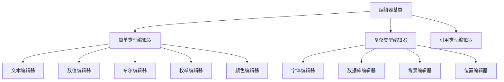
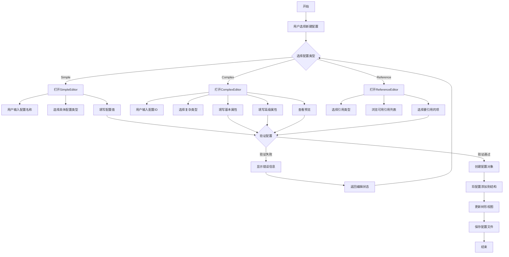

# 配置管理系统开发规范

## 项目目标

ConfigEditor的设计目的是为了解决最终用户使用程序时需要进行配置但对配置文件设置不熟悉或容易出错的问题。通过提供一个通用的图形界面，使开发人员和最终用户都能够按照标准化的方法生成和修改配置文件，确保配置的正确性和一致性。

核心设计思路：
- 简单的配置项存储在INI文件中
- 复杂的配置项存储在JSON文件中
- INI文件中指定关联的JSON文件（默认为同名文件）
- 针对不同类型的配置项提供专用的编辑器

## 一、总体架构设计

### 1. 系统分层结构
- **基础层**：配置存储和访问抽象
- **核心层**：配置对象模型和管理器
- **界面层**：可视化编辑和预览组件

### 2. 核心数据结构
- 配置对象基类 (TConfigObject)
- 配置对象元数据 (TConfigObjectMeta)
- 配置管理器 (TConfigManager)

## 二、文件组织结构

### 1. 核心模块
- `ConfigEditor.dpr`: 项目主文件，定义应用程序入口点
- `ViewMain.pas/dfm`: 主窗体实现，提供UI框架
- `ControllerMain.pas`: 主控制器，协调模型和视图之间的交互
- `ModelConfig.pas`: 配置模型，处理配置数据的核心逻辑

### 2. 配置文件管理
- `ConfigTypes.pas`: 配置数据类型定义
- `ConfigManager.pas`: 配置管理器，负责配置文件的加载和保存
- `ConfigRegistry.pas`: 配置类型注册表，管理不同的配置类型
- `INIConfig.pas`: INI文件的具体实现
- `JSONConfig.pas`: JSON文件的具体实现

### 3. 编辑器实现
- `ConfigEditorFrame.pas/dfm`: 通用编辑器框架
- `SimpleEditors.pas`: 简单类型编辑器实现
- `ComplexEditors.pas`: 复杂类型编辑器实现
- `ReferenceEditor.pas`: 引用类型编辑器实现
- `FontEditor.pas/dfm`: 字体编辑器的具体实现

### 4. 辅助工具
- `ConfigTree.pas`: 配置树操作辅助函数
- `HelperForm.pas`: 表单操作辅助函数
- `UtilsLog.pas`: 日志工具
- `UtilsStrs.pas`: 字符串处理工具
- `UtilsUTF8.pas`: UTF8编码处理工具
- `UTF8Converter.pas/dfm`: UTF8转换工具界面

### 5. 接口定义
- `ViewIntf.pas`: 视图接口定义
- `ControllerIntf.pas`: 控制器接口定义

## 三、配置文件结构

### 1. 双文件结构

ConfigEditor采用INI+JSON的双文件结构：

- **INI文件**：存储简单类型的配置项和关联JSON文件的路径
- **JSON文件**：存储复杂类型的配置项

### 2. INI文件格式示例

```ini
[json_file]
file_path = app_config.json  ; 关联的JSON文件

[app_settings]
etText.app_name = 应用程序示例
etText.version = 1.0.0
etBoolean.debug_mode = true
etNumber.timeout = 30

[ui_settings]
etEnum.theme = dark,light,custom
etColor.primary_color = #0078D7
etBoolean.show_welcome = true
```

### 3. JSON文件格式示例

```json
{
  "fonts": {
    "main_font": {
      "_type": "etFont",
      "_id": "etFont.main_font",
      "name": "微软雅黑",
      "size": 12,
      "color": "#000000",
      "bold": false,
      "italic": false
    }
  },
  "database": {
    "main_connection": {
      "_type": "etDatabase",
      "_id": "etDatabase.main_connection",
      "driver": "mysql",
      "host": "localhost",
      "port": 3306,
      "database": "mydb",
      "username": "user",
      "password": "encrypted:XXXXX"
    }
  }
}
```

### 4. 命名规范

- INI文件中的键名格式：`etType.KeyName`，其中etType指定配置类型
- JSON文件中使用`_type`属性指定配置类型，使用`_id`属性指定唯一标识符
- 配置文件命名建议使用有意义的名称，如`app_config.ini`、`user_settings.ini`等

## 四、配置类型系统

**注意：** 完整的配置属性类型列表已移至 [attribute.md](attribute.md) 文件。该文档按照使用频率从高到低列出了所有简单和复杂属性类型，包含每种类型的描述和使用场景。

```pascal
// ConfigTypes.pas
type
  // 配置组类型 - 用于区分简单类型和复杂类型
  TConfigGroupType = (
    cgtSimple,     // 简单类型（存储在INI文件中）
    cgtComplex     // 复杂类型（存储在JSON文件中）
  );
```

### 2. 配置对象元数据

```pascal
// 配置对象元数据
  TConfigObjectMeta = class
  public
    Name: string;        // 配置类型名称
    Description: string; // 配置类型描述
    Category: Integer;   // 类别索引(用于分组)
    Format: TConfigFormat; // 存储格式
    ConfigType: TConfigType; // 配置类型
    EditorClass: TClass; // 编辑器类

    constructor Create(const AName, ADescription: string;
                       ACategory: Integer; AFormat: TConfigFormat;
                       AConfigType: TConfigType; AEditorClass: TClass);
  end;
```

### 3. 配置对象基类

```pascal
// 配置对象基类
  TConfigObject = class abstract
  protected
    FID: string;
    FName: string;
    FFileName: string;
    FTypeID: string;
    FModified: Boolean;
    FConfigType: TConfigType;
  public
    constructor Create(const AID, AName, AFileName, ATypeID: string; AConfigType: TConfigType); virtual;

    // 加载与保存
    function Load: Boolean; virtual; abstract;
    function Save: Boolean; virtual; abstract;

    // 验证
    function Validate: Boolean; virtual;
    function GetValidationErrors: TArray<string>; virtual;

    // 属性
    property ID: string read FID write FID;
    property Name: string read FName write FName;
    property FileName: string read FFileName write FFileName;
    property TypeID: string read FTypeID;
    property ConfigType: TConfigType read FConfigType;
    property Modified: Boolean read FModified write FModified;
  end;
```

## 五、配置存储实现

### 1. INI配置实现

```pascal
// INIConfig.pas
type
  // INI配置文件处理类
  TINIConfig = class
  private
    FIniFile: TMemIniFile;
    FFilePath: string;
    FModified: Boolean;

    // 辅助方法
    procedure EnsureFileExists;
    function EncryptString(const Value: string): string;
    function DecryptString(const Value: string): string;
  public
    constructor Create;
    destructor Destroy; override;

    // 加载INI文件
    procedure LoadFromFile(const FilePath: string);
    // 保存INI文件
    procedure SaveToFile(const FilePath: string);
    // 清空INI内容
    procedure Clear;

    // 获取所有节名
    function ReadSections: TArray<string>;
    // 获取指定节中的所有键
    function ReadSection(const Section: string): TArray<string>;

    // 读取INI值
    function ReadString(const Section, Key, Default: string): string;
    function ReadInteger(const Section, Key: string; Default: Integer): Integer;
    function ReadBool(const Section, Key: string; Default: Boolean): Boolean;
    function ReadFloat(const Section, Key: string; Default: Double): Double;
    function ReadDate(const Section, Key: string; Default: TDateTime): TDateTime;
    function ReadDateTime(const Section, Key: string; Default: TDateTime): TDateTime;
    function ReadTime(const Section, Key: string; Default: TDateTime): TDateTime;

    // 写入INI值
    procedure WriteString(const Section, Key, Value: string);
    procedure WriteInteger(const Section, Key: string; Value: Integer);
    procedure WriteBool(const Section, Key: string; Value: Boolean);
    procedure WriteFloat(const Section, Key: string; Value: Double);
    procedure WriteDate(const Section, Key: string; Value: TDateTime);
    procedure WriteDateTime(const Section, Key: string; Value: TDateTime);
    procedure WriteTime(const Section, Key: string; Value: TDateTime);

    // 删除操作
    procedure DeleteKey(const Section, Key: string);
    procedure DeleteSection(const Section: string);

    // 属性
    property FilePath: string read FFilePath;
    property Modified: Boolean read FModified write FModified;
  end;
```

### 2. JSON配置实现

```pascal
// JSONConfig.pas
type
  TJSONConfig = class
  private
    FRootObject: TJSONObject;
    FFilePath: string;
    FModified: Boolean;

    // 辅助方法
    function CreateJSONPath(const Path: string): TJSONObject;
    function ExtractJSONObject(JSONValue: TJSONValue): TJSONObject;
    function FindJSONValue(const Path: string): TJSONValue;
  public
    constructor Create;
    destructor Destroy; override;

    // 文件操作
    procedure LoadFromFile(const FilePath: string);
    procedure SaveToFile(const FilePath: string);
    procedure Clear;

    // 读取操作
    function GetJSONObject(const Path: string): TJSONObject;
    function GetJSONArray(const Path: string): TJSONArray;
    function GetJSONValue(const Path: string): TJSONValue;

    // 路径操作
    function GetRootKeys: TArray<string>;
    function GetChildKeys(const Path: string): TArray<string>;

    // 写入操作
    procedure SetJSONObject(const Path: string; JSONObj: TJSONObject);
    procedure SetJSONArray(const Path: string; JSONArray: TJSONArray);
    procedure SetJSONValue(const Path: string; JSONValue: TJSONValue);

    // 添加和删除操作
    procedure AddJSONObject(const ParentPath, Name: string; JSONObj: TJSONObject);
    procedure DeleteJSONObject(const Path: string);

    // 引用操作
    function FindObjectByID(const ID: string): TJSONObject;

    // 属性
    property RootObject: TJSONObject read FRootObject;
    property FilePath: string read FFilePath;
    property Modified: Boolean read FModified write FModified;
  end;
```

## 六、配置管理器实现

```pascal
// ConfigManager.pas
type
  TConfigManager = class
  private
    FINIConfig: TINIConfig;
    FJSONConfig: TJSONConfig;
    FINIFilePath: string;
    FJSONFilePath: string;
    FIsModified: Boolean;

    function GetJSONPathFromINI(const INIPath: string): string;
    procedure SetIsModified(const Value: Boolean);
  public
    constructor Create;
    destructor Destroy; override;

    // 加载配置文件
    function LoadFromFile(const INIFilePath: string): Boolean;
    // 保存配置文件
    function SaveToFile: Boolean;
    // 保存为新文件
    function SaveAsNewFile(const NewINIFilePath: string): Boolean;

    // 获取INI配置中的所有节
    function GetINISections: TArray<string>;
    // 获取指定节中的所有键
    function GetINIKeys(const Section: string): TArray<string>;
    // 获取INI配置值
    function GetINIValue(const Section, Key: string): string;
    // 设置INI配置值
    procedure SetINIValue(const Section, Key, Value: string);

    // 获取JSON配置中的所有顶级键
    function GetJSONRootKeys: TArray<string>;
    // 获取JSON对象的子键
    function GetJSONChildKeys(const JSONPath: string): TArray<string>;
    // 获取JSON对象
    function GetJSONObject(const JSONPath: string): TJSONObject;
    // 创建或更新JSON对象
    procedure SetJSONObject(const JSONPath: string; JSONObj: TJSONObject);

    // 添加新的INI配置项
    procedure AddINIConfigItem(const Section, Key, DefaultValue: string; ConfigType: TConfigType);
    // 删除INI配置项
    procedure DeleteINIConfigItem(const Section, Key: string);

    // 添加新的JSON配置项
    procedure AddJSONConfigItem(const ParentPath, Name: string; JSONObj: TJSONObject);
    // 删除JSON配置项
    procedure DeleteJSONConfigItem(const JSONPath: string);

    // 查找引用的对象
    function FindReferenceObject(const RefID: string): TJSONObject;

    property INIFilePath: string read FINIFilePath;
    property JSONFilePath: string read FJSONFilePath;
    property IsModified: Boolean read FIsModified write SetIsModified;
    property INIConfig: TINIConfig read FINIConfig;
    property JSONConfig: TJSONConfig read FJSONConfig;
  end;
```

## 七、编辑器实现

### 1. 编辑器框架

```pascal
// ConfigEditorFrame.pas
type
  // 编辑器类型枚举 - 保持与ControllerMain中的定义一致
  TEditorType = (etJSON, etINI, etXML, etText);

  // 配置编辑器框架
  TframeConfigEditor = class(TFrame)
    pnlTop: TPanel;
    pnlClient: TPanel;
    btnSave: TButton;
    btnValidate: TButton;
    lblConfigPath: TLabel;
    splitter: TSplitter;
    tvStructure: TTreeView;
    pnlEditor: TPanel;
    procedure btnSaveClick(Sender: TObject);
    procedure btnValidateClick(Sender: TObject);
    procedure tvStructureChange(Sender: TObject; Node: TTreeNode);
  private
    FConfigManager: TConfigManager;
    FConfigPath: string;
    FEditorType: TEditorType;
    FModified: Boolean;

    procedure SetConfigPath(const Value: string);
    procedure DoModified;
    procedure UpdateStructureTree;

    // INI编辑器相关
    procedure CreateINIEditor;
    procedure LoadINIStructure;
    procedure UpdateINIEditor(const Section, Key: string);

    // JSON编辑器相关
    procedure CreateJSONEditor;
    procedure LoadJSONStructure;
    procedure UpdateJSONEditor(const JSONPath: string);

    // 辅助方法
    procedure ClearEditorControls;
    function CreateValueEditor(EditorPanel: TPanel; ConfigType: TConfigType): TControl;
  public
    constructor Create(AOwner: TComponent); override;
    destructor Destroy; override;

    // 初始化和配置
    procedure Initialize(const AConfigPath: string; AEditorType: TEditorType);

    // 操作方法
    function LoadConfig: Boolean;
    function SaveConfig: Boolean;
    function ValidateConfig: Boolean;

    // 获取当前编辑的配置项的信息
    function GetCurrentConfigType: TConfigType;
    function GetCurrentConfigPath: string;
    function GetCurrentSection: string;
    function GetCurrentKey: string;

    property ConfigPath: string read FConfigPath write SetConfigPath;
    property EditorType: TEditorType read FEditorType;
    property Modified: Boolean read FModified;
  end;
```

### 2. 简单类型编辑器

```pascal
// SimpleEditors.pas
type
  TfrmSimpleEditor = class(TForm)
    pnlButtons: TPanel;
    btnOK: TButton;
    btnCancel: TButton;
    pnlMain: TPanel;
    lblType: TLabel;
    lblName: TLabel;
    lblValue: TLabel;
    cmbType: TComboBox;
    edtName: TEdit;
    pnlValue: TPanel;
    procedure FormCreate(Sender: TObject);
    procedure cmbTypeChange(Sender: TObject);
    procedure btnOKClick(Sender: TObject);
  private
    FValueEditor: TControl;
    FConfigType: TConfigType;
    FSection: string;
    FOriginalKey: string;
    FOriginalValue: string;

    procedure CreateValueEditor;
    function GetConfigType: TConfigType;
    function GetKeyName: string;
    function GetValue: string;
    procedure SetConfigType(const Value: TConfigType);
    procedure SetKeyName(const Value: string);
    procedure SetSection(const Value: string);
    procedure SetValue(const Value: string);
  public
    property Section: string read FSection write SetSection;
    property ConfigType: TConfigType read GetConfigType write SetConfigType;
    property KeyName: string read GetKeyName write SetKeyName;
    property Value: string read GetValue write SetValue;
  end;
```

### 3. 复杂类型编辑器

```pascal
// ComplexEditors.pas
type
  TfrmComplexEditor = class(TForm)
    pnlButtons: TPanel;
    btnOK: TButton;
    btnCancel: TButton;
    pnlMain: TPanel;
    lblType: TLabel;
    lblID: TLabel;
    cmbType: TComboBox;
    edtID: TEdit;
    pcEditors: TPageControl;
    tsBasic: TTabSheet;
    tsAdvanced: TTabSheet;
    tsPreview: TTabSheet;
    procedure FormCreate(Sender: TObject);
    procedure cmbTypeChange(Sender: TObject);
    procedure btnOKClick(Sender: TObject);
  private
    FJSONObject: TJSONObject;
    FConfigType: TConfigType;
    FOriginalID: string;
    FBasicEditor: TControl;
    FAdvancedEditor: TControl;
    FPreviewControl: TControl;

    procedure CreateEditors;
    procedure UpdatePreview;
    function GetConfigType: TConfigType;
    function GetID: string;
    function GetJSONObject: TJSONObject;
    procedure SetConfigType(const Value: TConfigType);
    procedure SetID(const Value: string);
    procedure SetJSONObject(const Value: TJSONObject);
  public
    property ConfigType: TConfigType read GetConfigType write SetConfigType;
    property ID: string read GetID write SetID;
    property JSONObject: TJSONObject read GetJSONObject write SetJSONObject;
  end;
```

### 4. 引用类型编辑器

```pascal
// ReferenceEditor.pas
type
  TfrmReferenceEditor = class(TForm)
    pnlButtons: TPanel;
    btnOK: TButton;
    btnCancel: TButton;
    pnlMain: TPanel;
    lblType: TLabel;
    lblID: TLabel;
    cmbType: TComboBox;
    edtID: TEdit;
    lblReference: TLabel;
    tvReferences: TTreeView;
    btnBrowse: TButton;
    procedure FormCreate(Sender: TObject);
    procedure cmbTypeChange(Sender: TObject);
    procedure btnBrowseClick(Sender: TObject);
    procedure btnOKClick(Sender: TObject);
    procedure tvReferencesChange(Sender: TObject; Node: TTreeNode);
  private
    FConfigManager: TConfigManager;
    FConfigType: TConfigType;
    FReferenceID: string;
    FOriginalID: string;

    procedure LoadReferences;
    procedure UpdateReferenceTree;
    function GetConfigType: TConfigType;
    function GetID: string;
    function GetReferenceID: string;
    procedure SetConfigType(const Value: TConfigType);
    procedure SetID(const Value: string);
    procedure SetReferenceID(const Value: string);
  public
    property ConfigType: TConfigType read GetConfigType write SetConfigType;
    property ID: string read GetID write SetID;
    property ReferenceID: string read GetReferenceID write SetReferenceID;
  end;
```

## 八、用户界面设计

### 1. 主界面布局

```
+-----------------------------------------------+
| 菜单栏                                        |
+-----------------------------------------------+
| 工具栏                                        |
+--------+----------------------------------+---+
|        |                                  |   |
|        | 简单类型编辑区 (ValueListEditor) |   |
|        |                                  |   |
|        +----------------------------------+   |
| 树形   |                                  |   |
| 视图   | 配置编辑区 (PageControl)         |   |
|        |                                  |   |
|        |                                  |   |
+--------+----------------------------------+---+
| 状态栏                                        |
+-----------------------------------------------+
```

### 2. 编辑器系统



### 3. 配置对象选择对话框

```
+---------------------------------------+
| 选择配置对象类型                      |
+---------------------------------------+
| +-------------+ +-------------------+ |
| | 类型列表    | | 类型说明          | |
| |             | |                   | |
| | - 字体      | | 字体配置:         | |
| | - 数据库连接| | 用于定义字体属性, | |
| | - 背景      | | 包括字体名称,     | |
| | - ...       | | 大小,颜色和样式等 | |
| +-------------+ +-------------------+ |
|                                       |
| 对象名称: [____________]              |
|                                       |
| [  确定  ]           [  取消  ]       |
+---------------------------------------+
```

### 4. 用户新建配置流程图



## 九、实现计划

### 1. MVP版本目标（两天内完成）

1. **基础功能**
   - 完成INI+JSON双文件结构的读写
   - 实现树形结构展示配置
   - 实现简单类型编辑器（文本、数值、布尔、枚举、颜色）
   - 实现基本的复杂类型编辑器（字体）

2. **用户界面**
   - 完成主界面布局
   - 实现配置树的展示和操作
   - 实现基本的文件操作（新建、打开、保存）

3. **核心功能**
   - 实现配置项的添加、编辑、删除
   - 实现基本的配置验证

### 2. 后续版本计划

1. **版本1.0**（一周内）
   - 完成所有基础类型编辑器
   - 实现引用机制
   - 添加配置模板支持
   - 完善错误处理和异常捕获

2. **版本1.5**（两周内）
   - 实现所有复杂类型编辑器
   - 添加实时预览功能
   - 实现配置导入/导出
   - 添加配置差异对比功能

3. **版本2.0**（一个月内）
   - 添加插件系统支持
   - 实现远程配置同步
   - 添加多语言支持
   - 实现配置版本控制

## 十、总结

ConfigEditor是一个功能强大的配置文件编辑器，采用INI+JSON双文件结构，为用户提供了直观、高效的配置编辑体验。通过专用编辑器和树形结构展示，用户可以轻松管理复杂的配置项。

在MVP版本中，我们将专注于实现核心功能，确保用户可以进行基本的配置编辑操作。后续版本将不断完善功能，提升用户体验，并添加更多高级特性。
