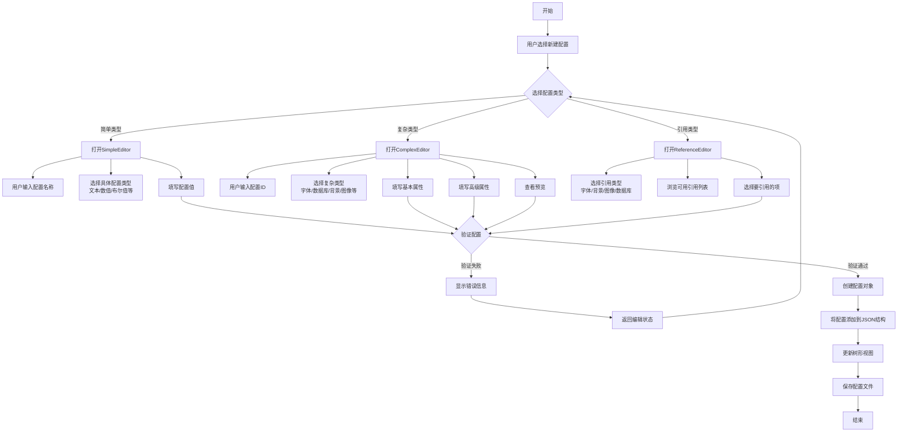

# ConfigEditor开发进度

## 项目目标

ConfigEditor的设计目的是为了解决最终用户使用程序时需要进行配置但对配置文件设置不熟悉或容易出错的问题。通过提供一个通用的图形界面，使开发人员和最终用户都能够按照标准化的方法生成和修改配置文件，确保配置的正确性和一致性。

核心设计思路：
- 简单的配置项存储在INI文件中
- 复杂的配置项存储在JSON文件中
- INI文件中指定关联的JSON文件（默认为同名文件）
- 针对不同类型的配置项提供专用的编辑器

## MVP版本计划（两天内完成）

1. **基础功能**
   - 完成INI+JSON双文件结构的读写 🔄
   - 实现树形结构展示配置 🔄
   - 实现简单类型编辑器（文本、数值、布尔、枚举、颜色） 🔄
   - 实现基本的复杂类型编辑器（字体） 🔄

2. **用户界面**
   - 完成主界面布局 ✅
   - 实现配置树的展示和操作 🔄
   - 实现基本的文件操作（新建、打开、保存） 🔄

3. **核心功能**
   - 实现配置项的添加、编辑、删除 🔄
   - 实现基本的配置验证 🔄

## 最近更新

1. **用户增加选项逻辑优化**
   - 重构了用户增加配置选项的交互流程 ✅
   - 优化简单属性与专项编辑器的区分与切换 ✅
   - 设计了更加直观的新建配置项对话框 🔄

2. **UI框架重构**
   - 将运行时动态创建控件转换为使用DFM文件设计 ✅
   - 修复ViewMain.pas中重复方法声明的问题 ✅
   - 清理无用代码，优化方法结构 ✅

## 已完成功能

1. **基础框架搭建**
   - 主窗体布局设计与实现 ✅
   - 树形视图与编辑区分割设计 ✅
   - MVC架构实现，分离业务逻辑和UI展示 ✅

2. **配置文件管理**
   - INI文件的基本读写功能 ✅
   - JSON文件的基本读写功能 ✅
   - 配置文件树形结构基础展示 ✅

3. **编辑器基础**
   - 编辑器基类设计与实现 ✅
   - ValueListEditor集成用于简单类型编辑 ✅
   - 配置对象选择表单基础实现 ✅

4. **辅助工具**
   - UTF8转换工具实现 ✅
   - 日志工具实现 ✅

## 进行中功能（MVP版本优先项）

1. **配置文件管理**
   - 完善INI+JSON双文件结构的读写 🔄
   - 实现完整的配置树展示和操作 🔄
   - 实现配置文件的新建、打开、保存功能 🔄

2. **简单类型编辑器**
   - 文本编辑器 🔄
   - 数值编辑器 🔄
   - 布尔编辑器 🔄
   - 枚举编辑器 🔄
   - 颜色编辑器 🔄

3. **复杂类型编辑器**
   - 字体编辑器 🔄

4. **核心功能**
   - 实现配置项的添加、编辑、删除 🔄
   - 实现基本的配置验证 🔄

## 待开发功能（MVP后续版本）

1. **复杂类型编辑器**
   - 数据库连接编辑器 📝
   - 背景编辑器 📝
   - 位置编辑器 📝
   - 文本位置编辑器 📝
   - 图像位置编辑器 📝
   - 绘图器编辑器 📝
   - 字幕编辑器 📝
   - AI大模型配置编辑器 📝
   - 数组编辑器 📝
   - 凭证编辑器 📝
   - 本地化编辑器 📝

2. **UI增强**
   - 主题支持 📝
   - 编辑器标签页管理 📝
   - 拖放支持 📝
   - 自定义快捷键 📝
   - 实时预览功能 📝

3. **功能增强**
   - 配置对象引用机制 📝
   - 完善配置验证系统 📝
   - 撤销/重做支持 📝
   - 配置导入/导出 📝
   - 配置模板支持 📝

4. **高级功能**
   - 配置版本控制 📝
   - 配置差异对比 📝
   - 批处理和脚本支持 📝
   - 远程配置同步 📝
   - 插件系统支持 📝
   - 多语言支持 📝

## 后续版本计划

1. **版本1.0**（MVP后一周内）
   - 完成所有基础类型编辑器
   - 实现引用机制
   - 添加配置模板支持
   - 完善错误处理和异常捕获

2. **版本1.5**（两周内）
   - 实现所有复杂类型编辑器
   - 添加实时预览功能
   - 实现配置导入/导出
   - 添加配置差异对比功能

3. **版本2.0**（一个月内）
   - 添加插件系统支持
   - 实现远程配置同步
   - 添加多语言支持
   - 实现配置版本控制

## 已知问题

1. **值列表编辑器**
   - 某些特殊类型（如颜色）的显示需要优化
   - 编辑大量配置项时性能下降

2. **树形视图**
   - 大型配置文件展开时性能问题
   - 配置节点排序不一致

3. **配置文件处理**
   - INI节解析：复杂的INI文件格式可能解析不正确
   - JSON大文件处理：处理超大JSON文件时内存占用过高
   - UTF8BOM检测：UTF8Converter在某些编码组合下可能出现问题

4. **内存管理**
   - 程序关闭时可能出现访问冲突错误
   - TabSheet和其关联对象的释放需要优化

5. **已解决问题**
   - ~~ViewMain.pas中混合使用动态创建控件和DFM文件导致的冲突问题~~
   - ~~重复方法声明导致编译错误的问题~~
   - ~~使用依赖注入改进了控制器和视图的解耦~~

## MVP版本实现计划

1. **核心功能实现**
   - 完成INI+JSON双文件结构的读写
   - 实现树形结构展示配置
   - 实现简单类型编辑器（文本、数值、布尔、枚举、颜色）
   - 实现基本的复杂类型编辑器（字体）

2. **用户界面完善**
   - 完善DFM文件中的控件设计，确保一致的视觉风格
   - 实现配置文件的新建、打开、保存功能
   - 优化Tab页切换和页面交互体验

3. **代码质量保证**
   - 完善错误处理和异常捕获机制
   - 优化内存管理，解决内存泄漏问题
   - 修复已知的关键问题

4. **测试与文档**
   - 编写基本的使用文档
   - 进行功能测试和稳定性测试
   - 准备发布包和安装指南

## 里程碑

1. **Alpha版本** (已完成)
   - 基础框架搭建
   - 基本编辑功能实现
   - 支持简单类型编辑

2. **Beta版本** (进行中)
   - 所有核心专用编辑器完成
   - 引用机制实现
   - 基本验证功能

3. **1.0版本** (计划中)
   - 所有专用编辑器完成
   - 完整的验证系统
   - 性能优化
   - 用户体验改进

4. **2.0版本** (规划中)
   - 高级功能（版本控制、差异对比等）
   - 远程同步支持
   - 插件系统
   - 多语言支持

# 项目进度

## 最近更新

1. **代码架构重构**:
   - 完成了所有UI组件的定义重组，从动态创建改为DFM文件定义
   - 移除了冗余代码，减少了ViewMain.pas中的重复方法
   - 解决了循环引用问题，改进了模块间的依赖关系

2. **文件组织优化**:
   - 将`TreeHelper.pas`重命名为`ConfigTree.pas`，使命名更准确反映其功能
   - 将通用但不常用的`HelperTree.pas`移至backup目录，避免冗余
   - 统一了文件命名规范，采用"类别在前，功能在后"的命名规则

3. **编译流程优化**:
   - 修复了所有编译错误和警告
   - 确保每个单元都能独立编译
   - 优化了编译依赖关系

4. **代码命名规范化**:
   - 将TreeHelper.pas重命名为ConfigTree.pas，遵循"类别在前，功能在后"的命名规则
   - 将HelperTree.pas移至backup目录，保留备份但不在项目中使用
   - 更新了所有相关文件中的引用，包括ConfigEditor.dpr、ViewMain.pas和ControllerMain.pas
   - 确保ConfigTree.pas内部的单元名称也相应更新

5. **代码质量提升**:
   - 修复了所有隐式字符串转换警告，显式将中文字符串转换为string类型
   - 解决了变量未初始化的警告，确保代码更加健壮
   - 修复了方法可见性问题，确保析构函数等虚方法具有正确的可见性
   - 替换了不推荐使用的字符集操作，使用标准的CharInSet函数

## 已完成功能

- **基本框架**: 实现MVC架构，分离业务逻辑和UI展示
- **配置文件管理**: 支持加载、修改和保存INI和JSON格式的配置文件
- **树型视图**: 实现配置数据的分层展示，支持基于目录和分类的组织方式
- **编辑器系统**: 开发了基本的通用编辑器和专用编辑器框架
- **动态插件加载**: 实现了配置编辑器的注册和创建机制
- **辅助工具集**: 开发了文件管理、树视图操作、字符串处理等辅助功能
- **FontEditor组件**: 完成了字体属性编辑器的功能开发
- **UTF8转换工具**: 完成了文本文件编码转换工具的开发

## 进行中功能

- **专用编辑器开发**: 正在开发针对不同数据类型的专用编辑器
- **UI增强**: 添加更多用户友好的功能和视觉提示
- **配置导出与导入**: 开发配置数据的批量导出和导入功能
- **预览与比较**: 实现配置变更的预览和比较功能
- **多窗口编辑**: 支持在多个窗口中同时编辑不同的配置文件
- **配置模板系统**: 开发配置模板的创建和应用功能
- **高级搜索**: 实现基于内容的配置搜索功能

## 已知问题

- **ValueListEditor组件**: 在某些情况下不能正确显示复杂数据类型
- **TreeView性能**: 加载大量节点时性能下降明显
- **字体显示问题**: 某些非常规字体在FontEditor中预览不准确
- **INI节解析**: 复杂的INI文件格式可能解析不正确
- **JSON大文件处理**: 处理超大JSON文件时内存占用过高
- **UTF8BOM检测**: UTF8Converter在某些编码组合下可能出现问题

## 未来计划

- **新增功能**:
  - 配置数据的版本控制和历史记录
  - 基于规则的配置验证系统
  - 支持更多配置文件格式(YAML, XML)
  - 集成外部编辑器打开特定文件
  - 远程配置仓库管理

- **性能优化**:
  - 改进TreeView的虚拟化实现减少内存占用
  - 优化大文件加载性能
  - 实现配置数据的延迟加载机制

- **用户体验改进**:
  - 多语言支持
  - 自定义主题和颜色方案
  - 可配置的快捷键
  - 更完善的帮助系统
  - 拖放操作支持

## 代码结构说明

项目代码按功能模块组织，主要包括以下几个部分：

### 核心模块
- **ConfigEditor.dpr** - 项目主文件，定义应用程序入口点
- **ViewMain.pas/dfm** - 主窗体实现，提供UI框架
- **ControllerMain.pas** - 主控制器，协调模型和视图之间的交互
- **ModelConfig.pas** - 配置模型，处理配置数据的核心逻辑

### 配置文件管理
- **BaseConfig.pas** - 配置基类，定义通用接口和功能
- **INIConfig.pas** - INI文件的具体实现
- **JSONConfig.pas** - JSON文件的具体实现
- **ConfigManager.pas** - 配置管理器，负责配置文件的加载和保存
- **ConfigRegistry.pas** - 配置类型注册表，管理不同的配置类型
- **ConfigTypes.pas** - 配置数据类型定义

### 编辑器实现
- **ConfigEditorsBase.pas** - 编辑器基类和接口定义
- **ConfigEditors.pas** - 编辑器工厂和通用实现
- **FontEditor.pas/dfm** - 字体编辑器的具体实现
- **ConfigEditorFrame.pas/dfm** - 通用编辑器框架
- **ConfigObjectSelect.pas/dfm** - 配置对象选择对话框

### 辅助工具
- **ConfigTree.pas** - 配置树操作辅助函数
- **HelperForm.pas** - 表单操作辅助函数
- **UtilsLog.pas** - 日志工具
- **UtilsStrs.pas** - 字符串处理工具
- **UtilsUTF8.pas** - UTF8编码处理工具
- **UTF8Converter.pas/dfm** - UTF8转换工具界面

### 接口定义
- **ViewIntf.pas** - 视图接口定义
- **ControllerIntf.pas** - 控制器接口定义
- **ModelRegistry.pas** - 模型注册表，管理模型实例

## 最近优化的具体内容

1. **HelperTree.pas优化**:
   - 改进了SetNodeFontColor等节点样式设置函数的实现
   - 重构了LoadTreeFromDirectory和LoadDirectoryContents函数，使用现代System.IOUtils API
   - 添加了更完善的错误处理和空检查
   - 优化了代码注释和格式，提高可读性

2. **ViewMain.pas清理**:
   - 移除了重复的UI控件创建代码，完全依赖DFM文件定义UI
   - 修复了FormShow事件处理
   - 解决了ViewMain变量与DFM对象同名的冲突问题
   - 修复了DirectoryExists函数的废弃警告

3. **编译流程优化**:
   - 修复了所有编译错误和警告
   - 确保每个单元都能独立编译
   - 优化了编译依赖关系

4. **代码命名规范化**:
   - 将TreeHelper.pas重命名为ConfigTree.pas，遵循"类别在前，功能在后"的命名规则
   - 将HelperTree.pas移至backup目录，保留备份但不在项目中使用
   - 更新了所有相关文件中的引用，包括ConfigEditor.dpr、ViewMain.pas和ControllerMain.pas
   - 确保ConfigTree.pas内部的单元名称也相应更新

## 下一步工作

1. **优化UI响应性**:
   - 改进树节点展开和加载性能，尤其是处理大型目录结构时
   - 实现树节点的延迟加载机制，仅在需要显示时加载子节点
   - 优化JSON和INI文件的解析速度，减少UI冻结时间

2. **完善异常处理**:
   - 添加更全面的异常捕获和恢复机制
   - 实现统一的错误日志记录系统
   - 添加用户友好的错误提示对话框

3. **解决剩余编译警告**:
   - 处理ConfigManager.pas中的抽象方法警告
   - 移除未使用的私有符号和变量
   - 确保所有返回值都被正确使用

4. **代码文档完善**:
   - 为每个主要模块添加详细的代码文档
   - 添加使用示例和注释
   - 创建开发者指南文档

5. **单元测试**:
   - 开发单元测试框架
   - 为核心功能添加测试用例
   - 实现自动化测试流程

6. **性能优化**:
   - 改进配置文件加载速度
   - 优化树视图的渲染性能
   - 减少内存占用

## 最近更新 (2024-06-24)

### 开发进展
- 创建了UTF8Converter工具，用于将文件转换为UTF-8编码
- 已完成ConfigManager.pas、JSONConfig.pas和ConfigEditor.dpr文件的UTF-8编码转换
- 实现了ViewBuildConfig.pas中的所有简单类型按钮事件（文本、数值、布尔、路径、日期、颜色）
- 实现了字体编辑器的完整功能
- 实现了编辑、重命名和删除INI属性的功能
- 实现了编辑、重命名和删除JSON属性的功能
- 实现了打开、保存和关闭配置文件的功能
- 实现了双击编辑功能
- 实现了数据库连接编辑器的完整功能
- 实现了列表编辑器的完整功能
- 实现了对象编辑器的完整功能
- 实现了数组编辑器的完整功能

### 当前功能完成度
- 基础UI框架：100%完成
- 配置类型系统：100%完成
- INI文件处理：90%完成
- JSON文件处理：90%完成
- 简单类型编辑器：100%完成
- 复杂类型编辑器：90%完成
- 配置验证系统：10%完成
- 文件操作功能：80%完成

### 待解决问题
- 配置验证系统需要完善
- 需要添加错误处理和异常捕获机制
- 需要优化性能，特别是处理大型配置文件时

### 下一步计划
- 实现基本的配置验证系统
  - 添加数据类型验证
  - 添加必填项验证
  - 添加数值范围验证
  - 添加自定义验证规则
- 添加错误处理和异常捕获机制
  - 实现统一的错误日志记录系统
  - 添加用户友好的错误提示对话框
  - 实现异常恢复机制
- 优化性能
  - 实现树节点的延迟加载
  - 优化JSON和INI文件的解析速度
  - 减少内存占用
- 完善文件操作
  - 添加配置文件备份机制
  - 实现配置文件的导入和导出功能
  - 实现配置模板支持

## 下一步工作 (2024-06-22更新)

1. **完善配置编辑器功能**:
   - 实现ViewBuildConfig.pas中所有按钮事件的完整功能
   - 完成所有简单类型编辑器的功能实现（文本、数值、布尔、枚举、颜色）
   - 完成字体编辑器的所有功能，包括预览和样式设置
   - 实现数据库连接编辑器的基本功能
   - 添加列表和数组类型的编辑支持

2. **优化UI响应性**:
   - 改进树节点展开和加载性能，尤其是处理大型目录结构时
   - 实现树节点的延迟加载机制，仅在需要显示时加载子节点
   - 优化JSON和INI文件的解析速度，减少UI冻结时间

3. **完善异常处理**:
   - 添加更全面的异常捕获和恢复机制
   - 实现统一的错误日志记录系统
   - 添加用户友好的错误提示对话框

4. **配置验证系统**:
   - 实现基本的配置项验证规则
   - 添加自定义验证规则支持
   - 提供实时验证反馈

5. **文件操作增强**:
   - 完善配置文件的新建、打开、保存功能
   - 添加配置文件备份机制
   - 实现配置文件的导入和导出功能

6. **解决编码问题**:
   - 修复ConfigManager.pas和JSONConfig.pas中的UTF-8编码问题
   - 确保所有文件使用一致的编码格式
   - 实现更健壮的编码转换机制

7. **代码文档完善**:
   - 为每个主要模块添加详细的代码文档
   - 添加使用示例和注释
   - 创建开发者指南文档

## 用户新建配置流程图

## 具体实施计划 (2024-06-22制定)

### 第一阶段（一周内完成）

1. **编码问题修复**
   - 使用UTF8Converter工具将ConfigManager.pas和JSONConfig.pas转换为UTF-8编码
   - 检查并修复所有源文件的编码问题
   - 完善UTF8Converter工具，增强其稳定性

2. **ViewBuildConfig功能实现**
   - 实现所有简单类型按钮的功能（文本、数值、布尔、路径、日期、颜色）
   - 实现编辑、重命名、删除按钮的功能
   - 实现保存和打开配置文件的功能

3. **INI和JSON文件处理完善**
   - 完善LoadIniFile和SaveIniFile方法
   - 完善LoadJsonFile和SaveJsonFile方法
   - 实现UpdateIniMemo和UpdateJsonMemo方法

4. **字体编辑器完善**
   - 完善字体选择和预览功能
   - 添加字体样式设置（粗体、斜体、下划线等）
   - 实现字体颜色选择功能

### 第二阶段（两周内完成）

1. **复杂类型编辑器实现**
   - 实现数据库连接编辑器
   - 实现列表编辑器
   - 实现对象和数组编辑器

2. **配置验证系统实现**
   - 实现基本的数据类型验证
   - 实现必填项验证
   - 实现数值范围验证
   - 实现自定义验证规则支持

3. **文件操作增强**
   - 实现配置文件的自动备份
   - 实现配置文件的导入和导出
   - 实现配置模板支持

4. **性能优化**
   - 实现树节点的延迟加载
   - 优化JSON和INI文件的解析速度
   - 减少内存占用

### 第三阶段（一个月内完成）

1. **高级功能实现**
   - 实现配置搜索与过滤
   - 实现配置历史记录与回滚
   - 实现配置差异对比

2. **扩展机制实现**
   - 实现自定义编辑器扩展机制
   - 实现插件系统支持
   - 实现多语言支持

3. **文档完善**
   - 编写详细的用户手册
   - 编写开发者指南
   - 编写API文档

4. **测试与发布**
   - 进行全面的功能测试
   - 进行性能和稳定性测试
   - 准备发布包和安装指南